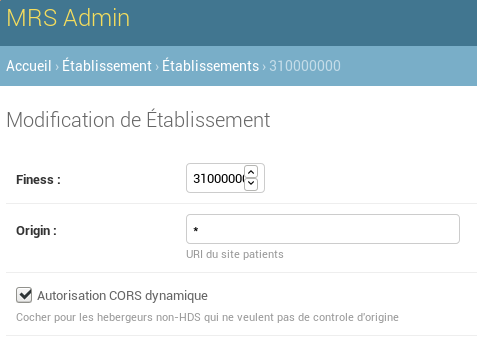

Tutoriel intégration iframe
~~~~~~~~~~~~~~~~~~~~~~~~~~~

Introduction
============

Vous mettez un site internet a disposition de vos patients et vous souhaitez
leur faciliter l'usage du formulaire MRS. MRS vous propose:

- d'uploader leur :term:`PMT`,
- d'afficher le formulaire pré rempli (Nom, Prénom, :term:`NIR`, email, date de
  naissance) dans une iframe,
- de recevoir l':term:`UUID` de la demande lorsque l'utilisateur valide le formulaire,
- de récupérer le statut d'une demande (Nouvelle, Validée, Refusée).

Pre-requis
==========

Pour le développement, vous aurez peut-être besoin de démarrer un serveur MRS
en local ou sur votre environnement de preprod. Pour cela, merci de vous
référer au tutoriel en question.

Il vous suffit de contacter MRS et de leur envoyer:

- votre numéro :term:`FINESS`,
- l'URL a autoriser en headers :term:`CORS`, ou alors si vous voulez utiliser le hack
  pour l'"autorisation :term:`CORS` dynamique".

:term:`CORS` crash course
=========================

Vous pouvez toujours exécuter une requête AJAX, cependant le navigateur
décidera si oui ou non il permet votre appel d'utiliser la réponse de la
ressource HTTP en question.

Avant toute chose, le navigateur fait une `requete de "preflight" CORS
<https://developer.mozilla.org/en-US/docs/Web/HTTP/CORS#Preflighted_requests>`_,
faisons quelques tests ensemble pour comprendre le fonctionnement::

    $ curl \
        -H "Origin: http://localhost:9000"  \
        -H "Access-Control-Request-Method: POST" \
        -H "Access-Control-Request-Headers: X-Requested-With" \
        -X OPTIONS \
        -I -v \
        'http://localhost:8000/institution/310000000/mrsrequest/iframe/?origin=http://lol/test'

    X-Frame-Options: ALLOW-FROM http://lol/test
    Access-Control-Allow-Origin: *

Si vous n'avez pas activé l'option de :term:`CORS` dynamique, alors MRS
n'autorise que l'URL définie par les admins et est insensible au paramètre origin::

    X-Frame-Options: ALLOW-FROM https://example.com/iframe.html
    Access-Control-Allow-Origin: https://example.com

Le choix vous appartient donc. A noter que toute mesure de sécurité qui n'est
pas prise des le départ en coutera si un jour MRS décide de ne plus autoriser
le CORS dynamique. Nous conseillons de prendre ses dispositions et partir sur des
bonnes pratiques des le départ, plutôt que de prendre un crédit technique sur
la question.

Configurer l'instance de dev
============================

Pour autoriser l'affichage de l'iframe, connectez vous sur l'interface
d'administration de votre instance de MRS, et ajoutez un "Établissement" avec
comme numéro de :term:`FINESS` le "310000000" et cochez la case "Autorisation :term:`CORS`
dynamique".

.. note:: En production vous pouvez contacter MRS pour indiquer l'URL que vous
          voulez autoriser en CORS pour afficher votre iframe.

Vous pourrez ensuite ouvrir::

    http://localhost:8000/institution/310000000/mrsrequest/iframe/

Passez l'URL que vous voulez utiliser dynamiquement grâce au paramètre GET
"origin"::

    $ curl -I http://localhost:8000/institution/310000000/mrsrequest/iframe/?origin=http://localhost:8000/your/url
    X-Frame-Options: ALLOW-FROM http://localhost:8000
    Access-Control-Allow-Origin: http://localhost:8000

Afficher l'iframe
=================

Vous pouvez afficher l'iframe soit depuis l'URL configurée dans l'admin pour
votre :term:`FINESS`, soit en passant le paramètre "origin" en paramètre GET, a
condition que la cache "Autorisation CORS dynamique" soit cochée pour ce
:term:`FINESS`.

Vous pouvez également passer les paramètres GET suivants:

- first_name, le prénom,
- last_name, le nom de famille,
- birth_date, la date de naissance, exemple 2000-12-31,
- nir, le numéro de sécurité sociale,
- email, l'email de l'assuré,
- hidePMT=1, pour cacher le champs d'upload de :term:`PMT` du formulaire initial si
  vous comptez la fournir a la place de l'assuré,

Example
-------

.. note:: Si le :term:`CORS` dynamique est actif alors vous devrez passer le parametre origin.

.. code-block:: html

    <iframe
      id="mrsrequest"
      src="https://www.mrs.beta.gouv.fr/institution/310000000/mrsrequest/iframe/?origin=http://votreserveur/iframe.html&first_name=Test%20Étienne&last_name=∞&birth_date=2000-12-31&nir=1234567890123&email=exemple@exemple.com"
      width="100%"
      height="800"
      style="border: none"
    ></iframe>

Résultat:

.. raw:: html

    

    

Uploader la :term:`PMT`
=======================

Ci dessus, le champs d'upload de :term:`PMT` est affiché des le départ dans le
formulaire pour que l'utilisateur puisse l'uploader. Ici, nous allons traiter
le cas dans lequel nous avons le fichier et nous voulons le soumettre a la
place de l'utilisateur pour lui faciliter la demande. Nous cacherons donc le
champs en ajoutant le paramètre GET ``hidePMT=1``.

Et nous passerons l'URL de la :term:`PMT` a l'iframe dans un message. Dans ce
cas, c'est l'iframe qui va télécharger le fichier et l'uploader ensuite pour la
demande ouverte dans l'iframe. Exécutez un tel appel avec une fonction de ce
type:

.. code-block:: javascript

    function uploadPMT() {
      document.getElementById('#iframe').contentWindow.postMessage(
        // votre pmt
        '{"pmt_url": "http://www.mrs.beta.gouv.fr/institution/example.jpg"}',
        // origine de l'iframe, peut aussi etre '*'
        'https://www.mrs.beta.gouv.fr'
      )
    }

.. raw:: html

    

    

    <input type="button" name="pmt-upload" value="Executer uploadPMT()" onclick="uploadPMT()" />

Si l'upload échoue pour une raison ou pour une autre, le formulaire ne validera
pas et demandera a ce moment la a l'utilisateur d'uploader sa :term:`PMT` dans
le formulaire.

.. danger:: Pour telecharger le fichier, l'iframe a besoin que l'URL passée
            réponde avec le header `Access-Control-Allow-Origin
            <https://developer.mozilla.org/fr/docs/HTTP/Headers/Access-Control-Allow-Origin>`_
            correspondant a l'URL de l'instance de MRS in question.

Recevoir l'UUID de demande
==========================

C'est l'iframe qui enverra l':term:`UUID` de la demande via un message lorsque le
formulaire sera validé. Vous pouvez le recevoir par exemple en exécutant ce
code avant que l'utilisateur ne soumette le formulaire avec succès::

    function receiveMessage(event) {
        console.log('mrsrequest_uuid:', event.data.mrsrequest_uuid)
    }
    window.addEventListener('message', receiveMessage)

Recuperer le statut de la demande
=================================

Pour récupérer le statut d'une demande, il suffit d'appeler l'URL de statut de
demande avec votre :term:`FINESS`, par exemple::

    $ curl https://mrs.beta.gouv.fr/institution/310000000/mrsrequest/470f3dbe-1f0a-4dfc-8bf1-95f8d504deb3/status/
    {"status": 0}

Les codes de statut sont:

- 0: Soumise
- 999: Rejetée
- 1000: En cours
- 2000: Validée

.. note:: Si le :term:`CORS` dynamique est actif alors vous devrez passer le
          parametre origin.
